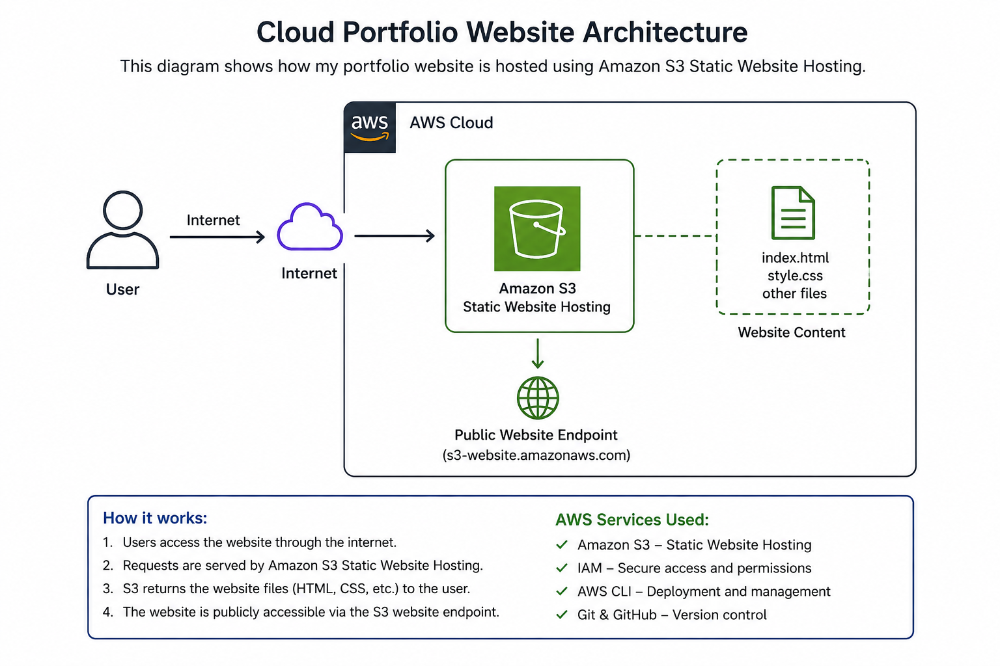
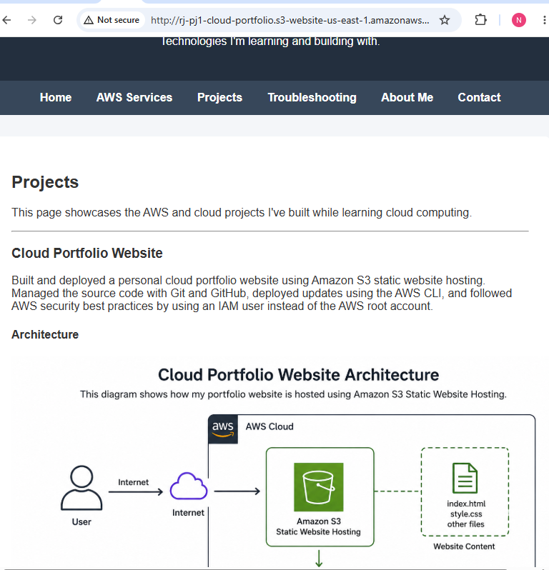

# AWS Cloud Portfolio Website

## Overview

This project is a personal cloud portfolio website built and hosted using Amazon S3 Static Website Hosting. It demonstrates foundational AWS cloud skills along with Git, GitHub, and the AWS CLI.

## Live Website

http://rj-pj1-cloud-portfolio.s3-website-us-east-1.amazonaws.com

## GitHub Repository

https://github.com/RLJ415/Cloud-Portfolio

## Technologies Used

- Amazon S3
- IAM
- AWS CLI
- Git
- GitHub
- HTML5
- CSS3

## Features

- Multi-page portfolio website
- Static website hosting on Amazon S3
- Architecture diagram
- Responsive navigation
- Git version control
- Live deployment

## Architecture

## Live Website Screenshot

## Skills Demonstrated

- Amazon S3 Static Website Hosting
- IAM security best practices
- Deploying files with AWS CLI
- Git version control
- GitHub repository management
- HTML and CSS fundamentals
- Troubleshooting cloud deployments

## Future Improvements

- Visitor Counter using API Gateway, Lambda, and DynamoDB
- Custom domain
- HTTPS with CloudFront
- Contact form backend
- CI/CD deployment pipeline